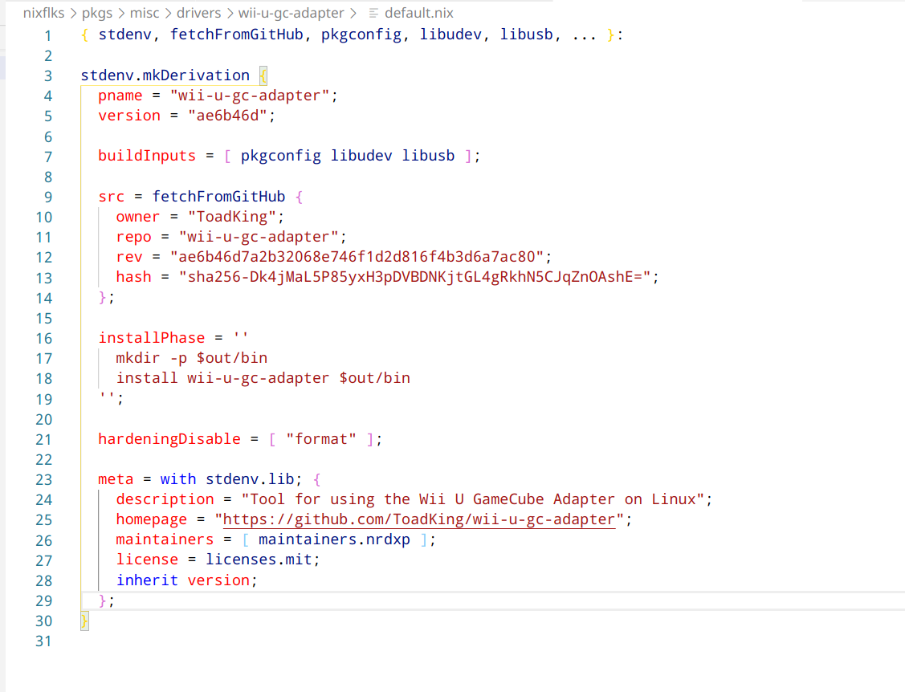
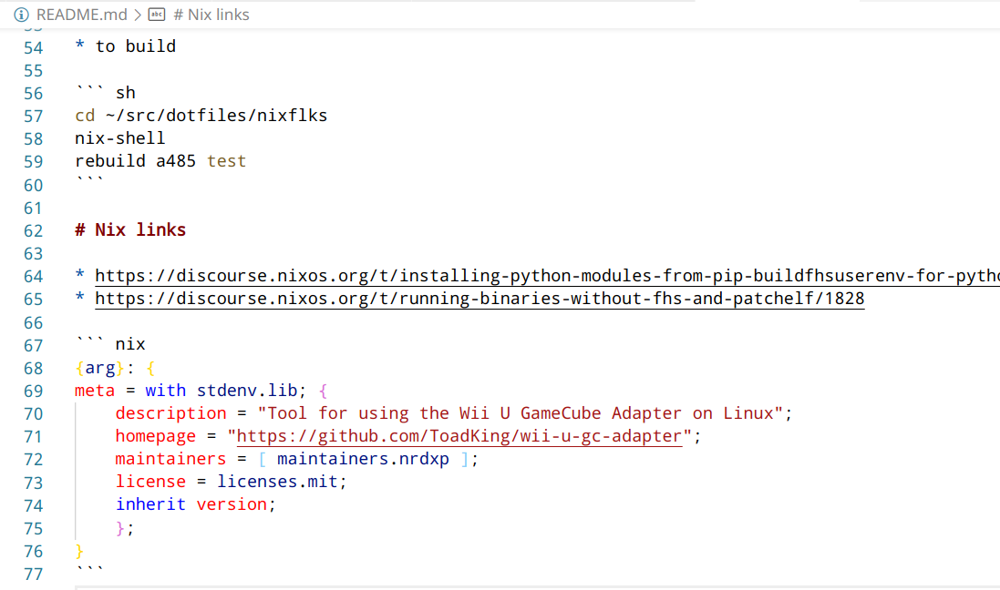
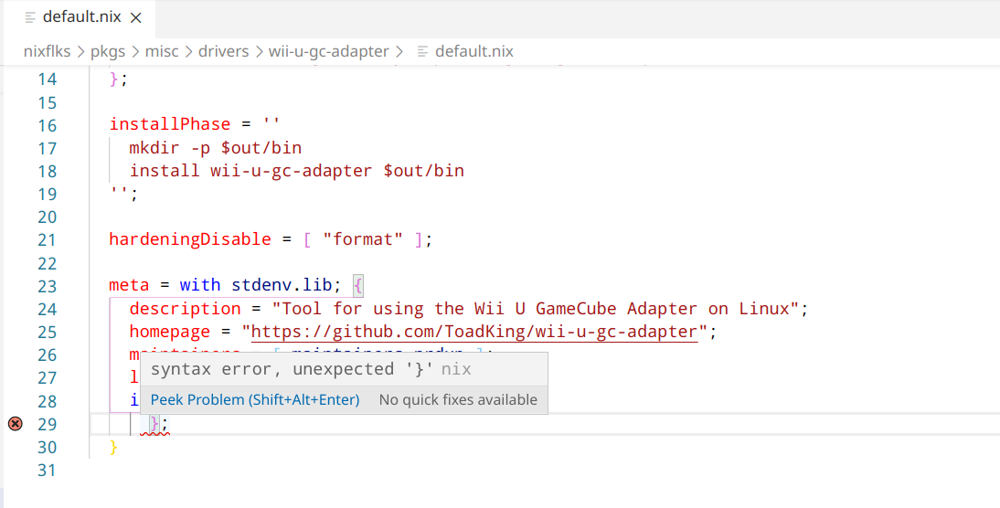

# nix README

Adds [nix](https://nixos.org/) language support for VSCode Editor.

## Features

* Syntax Highlight

  + Thanks to https://github.com/wmertens/sublime-nix for the grammar file

  

  + Nix code snippets inside `markdown` files also work.

  

* Full editing support when using a language server. Generally, any nix [LSP](https://microsoft.github.io/language-server-protocol/) implementation should work.  
The following are tested so far:

  - [rnix-lsp](https://github.com/nix-community/rnix-lsp)
  - [nil](https://github.com/oxalica/nil)
  - [nixd](https://github.com/nix-community/nixd)

    ```jsonc
    {
      "nix.enableLanguageServer": true,
      "nix.serverPath": "rnix-lsp"
      // "nix.serverPath": "nil"
      // "nix.serverPath": "nixd"
    }
    ```

  Pass settings to the language server via `serverSettings`.
    ```jsonc
    {
      "nix.serverSettings": {
        // settings for 'nil' LSP
        "nil": {
          "diagnostics": {
            "ignored": ["unused_binding", "unused_with"]
          },
          "formatting": {
            "command": ["nixpkgs-fmt"]
          }
        }
      }
    }
    ```

    ```jsonc
    {
        "nix.serverSettings": {
            // settings for 'nixd' LSP
            "nixd": {
                "eval": {
                    // stuff
                },
                "formatting": {
                    "command": "nixpkgs-fmt"
                },
                "options": {
                    "enable": true,
                    "target": {
                        // tweak arguments here
                        "args": [],
                        // NixOS options
                        "installable": "<flakeref>#nixosConfigurations.<name>.options"

                        // Flake-parts options
                        // "installable": "<flakeref>#debug.options"

                        // Home-manager options
                        // "installable": "<flakeref>#homeConfigurations.<name>.options"
                    }
                }
            }
      }
    }
    ```

* When `Language Server` support is not enabled the following tools are used to
  + Formatting support. Set `nix.formatterPath` to any command which can accept file contents on stdin and return formatted text on stdout; e.g.,
      ```jsonc
      {
        "nix.formatterPath": "nixpkgs-fmt" // default
        // "nix.formatterPath": "nixfmt"
        // "nix.formatterPath": ["treefmt", "--stdin", "{file}"]
        // "nix.formatterPath": ["nix", "fmt", "--", "-"] // using flakes with `formatter = pkgs.alejandra;`
      }
      ```
  + Error Report
    - Using `nix-instantiate` errors reported

  

* Snippets

## Todos

**PRs welcome** for them

* [embedded language](https://code.visualstudio.com/api/language-extensions/syntax-highlight-guide#embedded-languages) syntax support for bash
* path completion - https://github.com/ChristianKohler/PathIntellisense

## Installation

### Visual Studio Code

Hit `F1` and enter the `ext install jnoortheen.nix-ide` command or search for `nix-ide`.

### *.vsix file

The extension can be downloaded from the release page.

### Installing the extension Locally

Just clone the [GitHub repository](https://github.com/nix-community/vscode-nix-ide) under your local extensions folder:

* Windows: `%USERPROFILE%\.vscode\extensions`
* Mac / Linux: `$HOME/.vscode/extensions`

## Contributing

* Document the purpose of functions and classes.
* Please mention a new feature in the `README.md` Features section when adding it. Use screenshots when applicable.
* [Conventional Commit](https://www.conventionalcommits.org/en/v1.0.0/) style should be used for commit messages as it is used to generate changelog.

## Development

There is [direnv](https://direnv.net/) and [nix-shell](https://nixos.wiki/wiki/Development_environment_with_nix-shell) support so a dev environment can be created with the `nix-shell` command or a one-time `direnv allow` at the root of the repo.

Press `F5` in VSCode to run an Extension Development Host instance with the extension installed.

TypeScript is used to develop the extension.

```sh
yarn install # install dependencies
yarn build   # build the extension
```

## Releasing a new version

* fill `.env` from `.env.template`

```sh
# this is needed to publish extensions to [openvsx](https://open-vsx.org/) from local machine.
yarn env-cmd

# this will generate changelog and will create a GitHub release. This will also trigger jobs to publish the extension.
yarn release

# to manually publish the extension
yarn publish
```

---
Special thanks to
 * [wmertens](https://github.com/wmertens/sublime-nix/blob/master/nix.tmLanguage) for writing the syntax definitions.
 * The extension [vscode-fish](https://github.com/bmalehorn/vscode-fish/) is modified to work for `nix` .

## Links

* [Extension page](https://marketplace.visualstudio.com/items?itemName=jnoortheen.nix-ide) at vscode marketplace
* https://open-vsx.org/extension/jnoortheen/nix-ide
